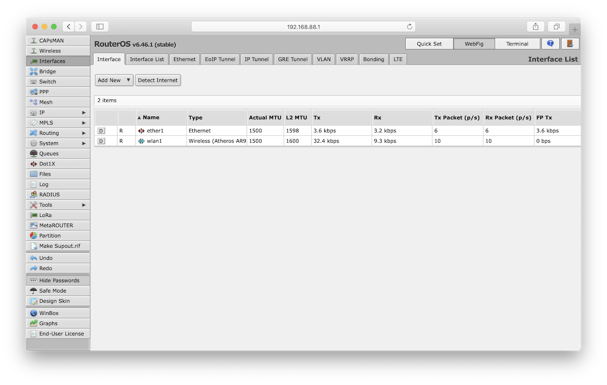
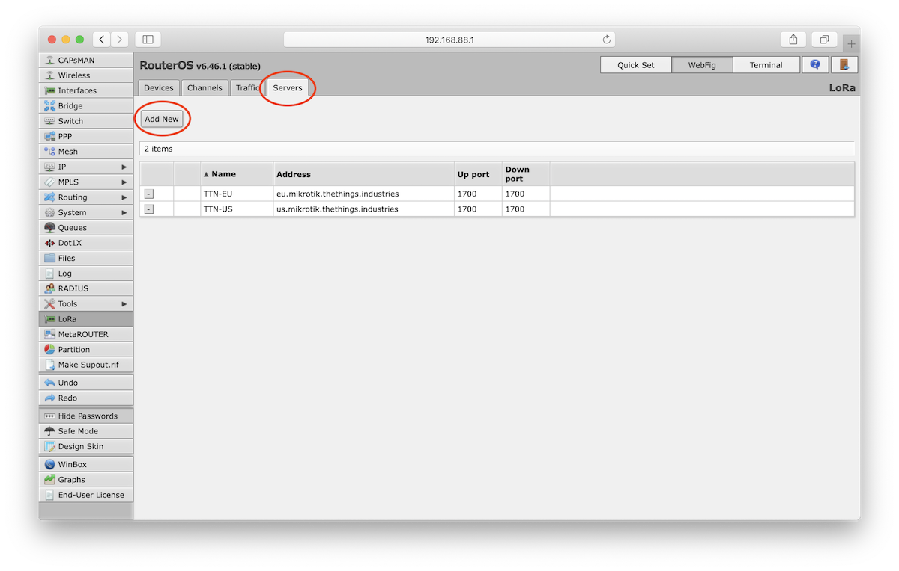
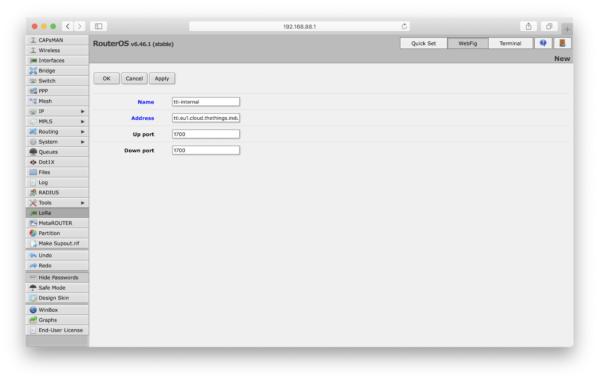
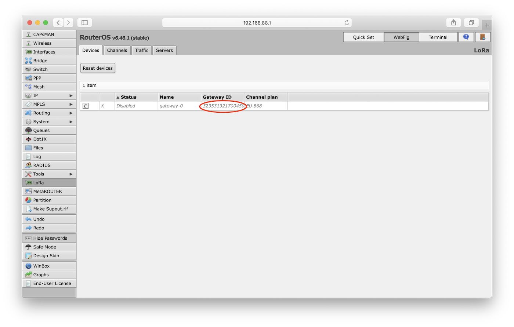



The MikroTik KNOT LR8/LR9 kit is a universal device with exceptional connectivity options and protocol support. It is an IoT Gateway which can use LTE-M (also known as CAT-M) technology as the gateway backhaul. 

<!--more-->

For more info, see Mikrotik's [official product page](https://mikrotik.com/product/knot)

 Currently, this gateway does not support changing Frequency Plans. 

## Prerequisites

1. User account on {} with rights to create Gateways.
2. MikroTik KNOT connected via Ethernet or LTE-M.
3. A web browser (see section [Configuration via Browser](#configuration-via-browser)), or the [MikroTik Mobile App](https://mikrotik.com/mobile_app) installed on a smartphone.

## Registration

Create a gateway by following the instructions for [Adding Gateways](). The **EUI** of the gateway can be found on the back panel of the gateway under the field **GW ID**, or under the **Gateway ID** in the LoRa tab of the MikroTik web GUI.

## Configuration via Browser

The MikroTik Routerboard exposes a WiFi Access Point (AP) with SSID `MikroTik-xxxxxx`, where `xxxxxx` are the last 6 digits of the device's MAC Address.

Use your PC, tablet or smartphone to connect to this AP. You will not need a password to connect to this AP.

Open a browser to `http://192.168.88.1/webfig/#Interfaces`.



Select **LoRa** on the left hand menu. The status of the gateway should be **Disabled** - if needed, press the **D** button to disable it.



The Gateway ID you see here is the Gateway EUI you need to register the gateway in The Things Stack.


From the top menu, select the **Servers** Tab and press the **Add New** button.



Edit the server parameters.

- **Name**: A distinct name
- **Address**: Address of the Gateway Server. If you followed the [Getting Started guide]() this is the same as what you use instead of `thethings.example.com`.
- **Up port**: UDP upstream port of the Gateway Server, typically `1700`.
- **Down port**: UDP downstream port of the Gateway Server, typically `1700`.

Press **OK** to save the parameters.



From the top menu, select the **Devices** tab. Click the **Gateway ID** to configure it.



In the device settings, click the **Network Servers** drop-down menu to view available servers. Choose the server you just created.

Select **Public** for the **Network** and click **OK** to save these parameters.

Press the **E** button to enable the gateway device (it is enabled when **E** becomes **D**) and the device status will update.

If your configuration was successful, your gateway will connect to {} after a couple of seconds.

## Set up LET-M
Connect an external antenna to the LTE-M antenna connector.


Go to **Interfaces**, click on **PPP-out1** and fill out the **APN settings** of your operator.

To test whether a connection is made to your LTE-M network, go to the Terminal in the RouterOS and run the command:

```
$ /interface ppp-client info ppp-out1
```
If the gateway is set up correct, the gateway will respond with a message like:

```
modem-status: ready
pin-status: no password required
functionality: full
manufacturer: Quectel
 model: BG77
 revision: BG77LAR02A04
current-operator: LMT (n/a)
signal-strength: -67 dBm
```